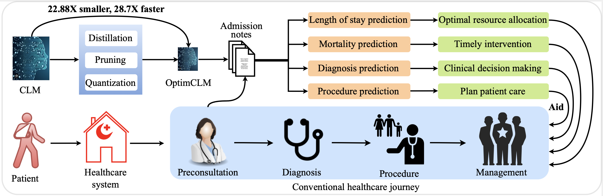
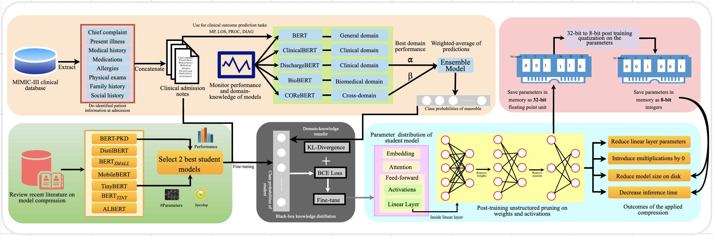
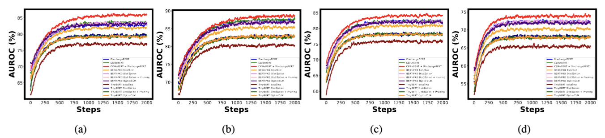

# OptimCLM: Optimizing Clinical Language Models for Predicting Patient Outcomes


## Introduction
This repository contains the implementation of OptimCLM, a framework designed to optimize Clinical Language Models (CLMs) for predicting patient outcomes through knowledge distillation, pruning, and quantization. The approach compresses CLMs without significant performance loss, thus facilitating their deployment in real-world clinical applications. This project uses admission notes from the MIMIC-III clinical database for the four clinical predictive tasks: mortality prediction, length of stay prediction, procedure prediction and diagnosis prediction. This repository contains the necessary codes for the length of stay prediction task. Other tasks can be similarly reproduced. The following diagram shows the motivation behind the research:



## Highlights
- Integration of clinical outcome prediction across the patient healthcare journey.
- Compression of clinical language models using knowledge distillation, pruning, and quantization.
- Enhancement of healthcare systems by optimizing resources and improving patient outcomes.
- Superior performance on major clinical outcome prediction tasks compared to state-of-the-art models.
- Effective domain-knowledge transfer through ensemble learning with distillation.

## Installation
To set up the necessary environment to run the code, please follow these instructions:

```bash
git clone https://github.com/junayed-hasan/Clinical-Language-Model-Distillation-Pruning-Quantization.git
cd Clinical-Language-Model-Distillation-Pruning-Quantization
```
This project requires Python 3.6+ and the following Python libraries installed:

- PyTorch
- Transformers
- Matplotlib
- NumPy
- Pandas
- scikit-learn
- SciPy
- Jupyter

Install PyTorch using the following command:
```bash
pip3 install torch torchvision torchaudio --index-url https://download.pytorch.org/whl/cu118
```

Install the libraries using the following command:

```bash
pip install transformers==4.15.0 matplotlib==3.4.3 numpy==1.21.2 pandas==1.3.3 scikit-learn==0.24.2 scipy==1.7.1 jupyter==1.0.0
```

## Dataset

To extract the datasets, follow the procedure outlined in the repository [clinical-outcome-prediction](https://github.com/bvanaken/clinical-outcome-prediction.git) and ensure you comply with their usage agreements.

## Running the notebooks
Start Jupyter Notebook in the project directory:
```bash
jupyter notebook
```
In the Jupyter interface, navigate to and open LOS_Ensemble.ipynb, run the notebook cells sequentially to create and save the weights of the ensemble model and get evaluation results.

Similarly, navigate to and open LOS_Optimization.ipynb, run the notebook cells sequentially to load the weights of the ensemble, fine-tune the student model, save the weights, load them, apply pruning, quantization and get evaluation results.

## The methodology followed is shown in the following diagram:


## Results

### Preliminary Results on State-of-the-Art Generalist and Clinical LLMs

The table below presents the preliminary results on five state-of-the-art LLMs for the four clinical outcome prediction tasks, represented in macro-averaged AUROC with standard deviations.

| Category | Model               | Diagnosis (%)     | Procedure (%)     | Mortality (%)     | Length of Stay (%) |
|----------|---------------------|-------------------|-------------------|-------------------|--------------------|
| Teacher  | BERT                | 81.34 ± 0.025     | 85.22 ± 0.042     | 80.64 ± 0.096     | 70.03 ± 0.070      |
|          | ClinicalBERT        | 81.49 ± 0.081     | 86.21 ± 0.081     | 82.08 ± 0.062     | 71.30 ± 0.023      |
|          | DischargeBERT       | 82.83 ± 0.067     | 87.09 ± 0.092     | 82.39 ± 0.054     | 72.29 ± 0.044      |
|          | BioBERT             | 82.64 ± 0.016     | 86.19 ± 0.092     | 82.38 ± 0.086     | 70.97 ± 0.087      |
|          | COReBERT            | 83.58 ± 0.011     | 87.61 ± 0.055     | 82.31 ± 0.036     | 72.13 ± 0.008      |
| Ensemble | COReBERT + DischargeBERT | 85.93 ± 0.072 | 88.67 ± 0.078 | 84.11 ± 0.038 | 73.82 ± 0.017      |

### Experimental Results on BERT-PKD and TinyBERT

The table below shows the experimental results on BERT-PKD and TinyBERT for the four clinical outcome prediction tasks, represented in macro-averaged AUROC with standard deviations.

| Experiment                  | Diagnosis (%)     | Procedure (%)     | Mortality (%)     | Length of Stay (%) |
|-----------------------------|-------------------|-------------------|-------------------|--------------------|
| BERT-PKD Baseline           | 81.87 ± 0.013     | 85.43 ± 0.026     | 80.90 ± 0.011     | 70.23 ± 0.057      |
| Distillation                | 83.41 ± 0.018     | 86.95 ± 0.002     | 82.17 ± 0.019     | 72.36 ± 0.032      |
| Distillation + Pruning      | 83.28 ± 0.025     | 86.87 ± 0.034     | 82.07 ± 0.007     | 71.95 ± 0.019      |
| Distillation + Pruning + Quantization | 83.15 ± 0.062 | 86.82 ± 0.051 | 82.06 ± 0.015 | 71.91 ± 0.010      |
| TinyBERT Baseline           | 76.92 ± 0.032     | 80.36 ± 0.057     | 75.81 ± 0.049     | 65.36 ± 0.074      |
| Distillation                | 79.63 ± 0.054     | 82.84 ± 0.012     | 78.25 ± 0.083     | 68.29 ± 0.002      |
| Distillation + Pruning      | 79.33 ± 0.005     | 82.68 ± 0.044     | 78.21 ± 0.044     | 67.91 ± 0.059      |
| Distillation + Pruning + Quantization | 79.23 ± 0.034 | 82.65 ± 0.070 | 78.11 ± 0.029 | 67.86 ± 0.038      |

### Ablation Experiments on Selected Teacher Models

The table below shows the ablation experiments on the selected teacher models in ensemble creation for the four clinical prediction tasks. The results show the macro-averaged AUROC% for each experiment. The best results, i.e., our used ensemble, is shown in bold.

| Knowledge-domain | Model                              | Diagnosis (%)  | Procedure (%) | Mortality (%) | Length of Stay (%) |
|------------------|------------------------------------|----------------|---------------|---------------|--------------------|
| Clinical         | ClinicalBERT + DischargeBERT       | 83.82 ± 0.021  | 87.22 ± 0.033 | 82.95 ± 0.016 | 72.53 ± 0.091      |
| Biomedical       | BERT + BioBERT                     | 83.04 ± 0.012  | 86.82 ± 0.007 | 82.44 ± 0.041 | 71.11 ± 0.063      |
| Cross-domain     | ClinicalBERT + BioBERT             | 84.07 ± 0.013  | 87.78 ± 0.011 | 83.17 ± 0.022 | 72.90 ± 0.023      |
| Cross-domain     | ClinicalBERT + COReBERT            | 84.46 ± 0.017  | 88.19 ± 0.005 | 83.85 ± 0.014 | 73.59 ± 0.024      |
| Cross-domain     | DischargeBERT + BioBERT            | 84.29 ± 0.036  | 87.98 ± 0.012 | 83.64 ± 0.016 | 72.69 ± 0.077      |
| Cross-domain     | BioBERT + COReBERT                 | 84.33 ± 0.031  | 88.15 ± 0.041 | 83.83 ± 0.071 | 73.11 ± 0.018      |
| **Cross-domain** | **COReBERT + DischargeBERT**       | **85.93 ± 0.072** | **88.67 ± 0.078** | **84.11 ± 0.038** | **73.82 ± 0.017** |

_Note: The best results are highlighted in bold._

### Model Compression Statistics by TinyBERT

The table below presents the model compression statistics by TinyBERT in all the experiments for the clinical outcome prediction tasks upon deployment on Amazon Linux AMI CPU on AWS cloud server. It shows the mean inference time per admission note, the number of parameters (in millions), model size (in megabytes), and compression ratio with respect to the ensemble model (and baseline models in parentheses).

| Experiment                      | Task | Inference Time(ms) | Speedup | #Params(M) | Size(MB) | Compression Ratio |
|---------------------------------|------|--------------------|---------|------------|----------|-------------------|
| COReBERT Baseline               | LOS  | 1187 ± 8           | 1.90x   | 110        | 433.25   | 2.00 (1.00)       |
|                                 | MP   | 1312 ± 12          | 1.99x   | 110        | 433.25   | 2.00 (1.00)       |
|                                 | PROC | 1500 ± 13          | 1.86x   | 110        | 433.25   | 2.00 (1.00)       |
|                                 | DIAG | 1437 ± 9           | 1.91x   | 110        | 433.25   | 2.00 (1.00)       |
| DischargeBERT Baseline          | LOS  | 1180 ± 11          | 1.93x   | 110        | 433.25   | 2.00 (1.00)       |
|                                 | MP   | 1327 ± 10          | 2.00x   | 110        | 433.25   | 2.00 (1.00)       |
|                                 | PROC | 1495 ± 12          | 2.00x   | 110        | 433.25   | 2.00 (1.00)       |
|                                 | DIAG | 1442 ± 17          | 1.87x   | 110        | 433.25   | 2.00 (1.00)       |
| COReBERT + DischargeBERT        | LOS  | 2255 ± 16          | 1.00x   | 220        | 866.50   | 1.00 (0.50)       |
|                                 | MP   | 2610 ± 11          | 1.00x   | 220        | 866.50   | 1.00 (0.50)       |
|                                 | PROC | 2790 ± 8           | 1.00x   | 220        | 866.50   | 1.00 (0.50)       |
|                                 | DIAG | 2744 ± 12          | 1.00x   | 220        | 866.50   | 1.00 (0.50)       |
| TinyBERT Baseline               | LOS  | 156 ± 4            | 14.38x  | 14.5       | 54.80    | 15.81 (7.91)      |
|                                 | MP   | 173 ± 7            | 15.06x  | 14.5       | 54.80    | 15.81 (7.91)      |
|                                 | PROC | 199 ± 8            | 14.02x  | 14.5       | 54.80    | 15.81 (7.91)      |
|                                 | DIAG | 195 ± 10           | 14.10x  | 14.5       | 54.80    | 15.81 (7.91)      |
| TinyBERT Distillation           | LOS  | 157 ± 7            | 14.38x  | 14.5       | 54.80    | 15.81 (7.91)      |
|                                 | MP   | 173 ± 2            | 15.02x  | 14.5       | 54.80    | 15.81 (7.91)      |
|                                 | PROC | 198 ± 2            | 14.12x  | 14.5       | 54.80    | 15.81 (7.91)      |
|                                 | DIAG | 194 ± 5            | 14.13x  | 14.5       | 54.80    | 15.81 (7.91)      |
| TinyBERT Distillation + Pruning | LOS  | 152 ± 2            | 14.82×  | 13.5       | 51.18    | 16.93 (8.47)      |
|                                 | MP   | 169 ± 4            | 15.45×  | 13.5       | 51.18    | 16.93 (8.47)      |
|                                 | PROC | 194 ± 3            | 14.36×  | 13.5       | 51.18    | 16.93 (8.47)      |
|                                 | DIAG | 189 ± 3            | 14.51×  | 13.5       | 51.18    | 16.93 (8.47)      |
|Distillation + Pruning + quantization           | LOS  | 82 ± 1             | 27.54×  | 13.5       | 37.87    | 22.88 (11.44)     |
|                                 | MP   | 91 ± 2             | 28.70×  | 13.5       | 37.87    | 22.88 (11.44)     |
|                                 | PROC | 110 ± 4            | 25.43×  | 13.5       | 37.87    | 22.88 (11.44)     |
|                                 | DIAG | 107 ± 1            | 25.69×  | 13.5       | 37.87    | 22.88 (11.44)     |

## Training curves


## Copyright and License

Copyright (c) 2024, Mohammad Junayed Hasan 

This project is licensed under the MIT License - see the [LICENSE](LICENSE) file for details.


